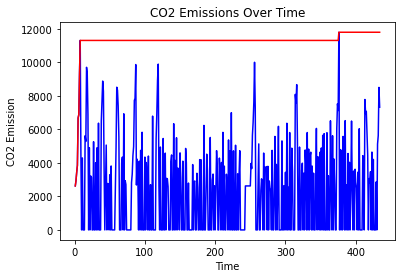

<p>
    
    <h1 style="float:left;color:#1A5276;padding-left:15px;font-size:20px;">AWS IoT Analytics | Notebook</h1>
</p>


When loading data from IoT Analytics datasets, the client should be initialized first:


```python
import boto3
import pandas as pd
import matplotlib.pyplot as plt
import numpy as np

# create IoT Analytics client
client = boto3.client('iotanalytics')
```

Now we can get the data location (URL) for the given dataset and start working with the data (In order to need to perform get_dataset_content, you need to grant iot analytics corresponding IAM permission):


```python
dataset = "vehicle_dataset"
dataset_url = client.get_dataset_content(datasetName = dataset)['entries'][0]['dataURI']
vehicle_data=pd.read_csv(dataset_url)
```

Now that the data has been retrieved, filter the dataset per each vehicle id. 


```python
vehicle_ids = ["veh0", "veh1", "veh2", "veh3", "veh4"]
vehicle_data_map = {}
for id in vehicle_ids:
    vehicle_data_map[id] = vehicle_data.loc[vehicle_data['vehicle_id'] == id]
```


```python
for vehicle_id in vehicle_data_map:
    df = vehicle_data_map[vehicle_id]
    df = df.dropna(how='any',axis=0) 
    df
    plt.plot(df['timestep_time'], df['vehicle_co2'], color='b')
    plt.plot(df['timestep_time'], df['max_co2_emission'], color='r')
    plt.ylabel('CO2 Emission')
    plt.xlabel('Time')
    plt.title('CO2 Emissions Over Time')
    plt.show()
```


    

    


    

    


    

    


    

    


    

    


```python
for vehicle_id in vehicle_data_map:
    df = vehicle_data_map[vehicle_id]
    df = df.dropna(how='any',axis=0) 
    df
    plt.scatter(df['vehicle_noise'], df['vehicle_speed'])
    plt.xlabel('Vehicle Noise')
    plt.ylabel('Vehicle Speed')
    plt.title('Vehicle Noise and Speed Relation')
    a, b = np.polyfit(df['vehicle_noise'], df['vehicle_speed'], 1)
    plt.plot(df['vehicle_noise'], a*df['vehicle_noise']+b, color='r')
    plt.show()
```


    

    


    

    


    

    


    

    


    

    


```python

```
